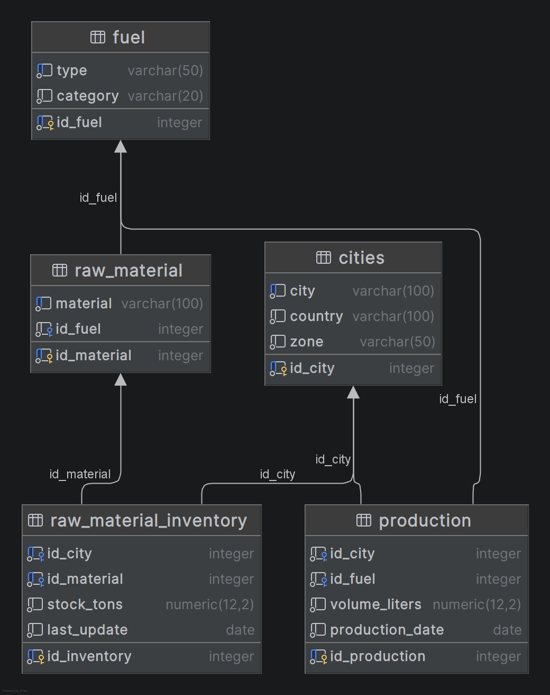

# db_plant - Biorefinery Production Simulator (Europe)

Este projeto consiste na modelagem e simulação de um banco de dados relacional para uma rede de usinas de produção de combustíveis (fósseis e biocombustíveis), aplicado ao cenário da Europa Central e do Norte. O objetivo principal é o estudo de modelagem de dados com SQL para análise de cenários de produção, logística e funcionamento de plantas industriais (*plants*).

---

## 📌 Visão Geral do Projeto

O sistema simula o fluxo operacional de biorefinarias localizadas em pontos estratégicos da Europa, rastreando desde a origem da matéria-prima até o volume final de combustível produzido. Atualmente, o projeto simula a produção de:
*   **Biocombustíveis:** Etanol (proveniente de beterraba sacarina e trigo) e Biodiesel (óleo de colza).
*   **Combustíveis de Aviação Sustentável (SAF):** Bioquerosene (óleo de cozinha reciclado e gordura animal).
*   **Combustíveis Fósseis:** Querosene tradicional (petróleo bruto) para fins de comparação de métricas.

O projeto utiliza o **PostgreSQL** para garantir a integridade dos dados através de restrições rígidas (`CONSTRAINTS` e `FOREIGN KEYS`) e chaves sequenciais automáticas.

---

## 🛠️ Tecnologias Utilizadas

*   **Banco de Dados:** PostgreSQL
*   **Linguagem:** SQL Puro (DDL e DML)
*   **IDE / Ferramenta de Banco de Dados:** DataGrip (utilizado para desenvolvimento, gerenciamento e geração de diagramas ER)
*   **Ambiente:** Execução e consultas via CLI (Terminal)

---

## 📂 Estrutura Atual do Banco

O núcleo do banco de dados já está operacional com as seguintes tabelas estruturadas:

1.  **`cities`**: Mapeia as cidades europeias, países e zonas geográficas.
2.  **`fuel`**: Controla os tipos de combustíveis e suas categorias (Fóssil ou Biocombustível).
3.  **`raw_material`**: Relaciona as matérias-primas aos combustíveis que elas geram.
4.  **`raw_material_inventory`**: Controla o estoque em toneladas de matérias-primas por cidade e a última atualização.
5.  **`production`**: Registra o volume diário em litros produzido por cada planta, associando a cidade e o tipo de combustível.

### 🗺️ Diagrama do Banco de Dados (ERD)

Abaixo está a representação visual das tabelas e seus relacionamentos, gerada através do DataGrip:

---

## 👥 Contribuição e Estudos

Este repositório foi criado para fins didáticos e de portfólio, demonstrando a aplicação prática de SQL em cenários industriais complexos e simulações de Business Intelligence (BI).